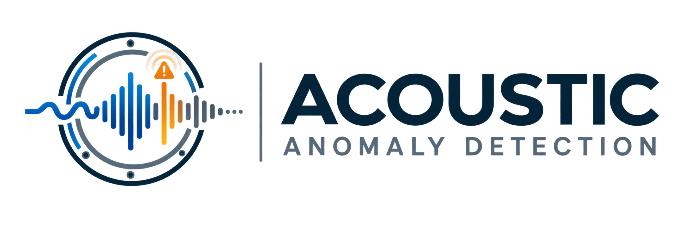
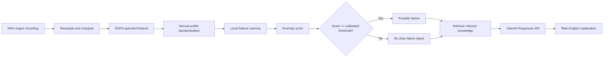

# Energy-Gated Frequency Network (EGFN)



EGFN is an interpretable audio anomaly-detection project for industrial
machines. It combines learnable frequency analysis, energy-based gating,
normal-operation profiles, local feature memory, and a bounded OpenAI
explanation layer.

The central product idea is simple:

```text
engine audio
    -> EGFN neural detector
    -> anomaly score and calibrated threshold
    -> possible failure / no clear failure signal
    -> retrieved manuals and repair history (when available)
    -> plain-English OpenAI explanation
```

The neural network makes the detection decision. OpenAI does not replace the
detector: it explains the measured result and its limitations for a non-
technical reader.

## What the demo does

The Streamlit app provides two connected views:

1. **Audio diagnosis**: upload a WAV recording, run the calibrated EGFN
   checkpoint, and receive a possible-failure result with an anomaly score.
2. **Knowledge base**: open the popup to add manuals, reports, repair records,
   and other project documents. Retrieved text can be supplied to the LLM as
   supporting context.

The current bundled checkpoint is calibrated for **MIMII valve audio**. Fan
support requires a separately trained and calibrated fan checkpoint; the app
does not silently apply the valve model to a fan recording.

## Quick start

Use the project environment, because model inference requires PyTorch:

```powershell
.\.venv\Scripts\Activate.ps1
python -m pip install -r requirements-dashboard.txt
python scripts\build_evidence_json.py
.\.venv\Scripts\python.exe -m streamlit run app\dashboard.py
```

Open `http://localhost:8502` if Streamlit selects port 8502.

The app loads `OPENAI_API_KEY` from the ignored `.env.local` file. OpenAI
explanations require API quota; EGFN audio detection remains local and works
without an API call.

## End-to-end pipeline



### 1. Audio preparation

The uploaded WAV is converted to mono, resampled to the checkpoint sample
rate, and center-cropped or zero-padded to the expected duration. The app does
not make a decision from the filename; the waveform is the model input.

### 2. Frequency frontend

The EGFN frontend receives a waveform `x[n]` and applies a bank of learnable
filters. For frequency band `k`:

```text
u_k[n] = (h_k * x)[n]
a_k[n] = activation(u_k[n] + b_k)
E_k   = mean(u_k[n]^2)
```

`u_k` is the filtered response, `a_k` is the activated response, and `E_k`
summarizes the energy present in the band. The frontend retains the band
structure instead of collapsing the signal immediately into an opaque vector.

### 3. Energy gates

The energy is transformed into a stable log scale and passed through learned
gates. In the independent form:

```text
g_k = sigmoid(alpha_k * log(1 + E_k) + beta_k)
y_k[n] = g_k * a_k[n]
```

The repository also implements macro, subband, hierarchical, and conditional
gate variants for controlled studies. A gate is an interpretable signal about
which bands the frontend is using; it is not, by itself, a causal explanation
of a prediction.

### 4. Normal-operation profile

The one-class detector is fitted using normal recordings only. For each
operating condition it stores statistics for stable energy descriptors such as
log energy and absolute temporal energy change. A new recording is
standardized against the matching condition when available, or against a
fallback profile when the condition is unknown.

This is why the app can flag an unusual recording without requiring a defect
label for every possible failure mode.

### 5. Local feature memory and score

The detector also stores a bounded memory of normal local feature descriptors.
For a new recording it measures the distance from its local descriptors to the
closest normal descriptors. The recording-level score pools the most unusual
local regions rather than averaging every frame equally.

The final decision is deterministic:

```text
possible_failure = anomaly_score >= validation_selected_threshold
```

The threshold is learned from validation data and kept separate from the test
set. It is not a universal physical constant and should be recalibrated when
the machine type, recording setup, or operating distribution changes.

### 6. Knowledge and explanation layer

Manuals and repair records are stored in SQLite as documents and text chunks.
When documentation exists, the app retrieves relevant chunks and sends only
that bounded context together with the audio diagnosis to OpenAI. When no
documentation exists, the detector still works and the LLM receives only the
diagnostic evidence.

The explanation layer is instructed to:

- state clearly whether the result indicates a possible valve failure;
- explain the score-versus-threshold result in ordinary language;
- suggest a practical next step without inventing a physical cause;
- disclose what the audio cannot confirm;
- cite the checkpoint or knowledge source used.

The LLM does not load checkpoints, query arbitrary SQL, change thresholds, or
override the EGFN result.

## Evidence and knowledge storage

The evidence export is generated from local experiment artifacts:

```powershell
python scripts\build_evidence_json.py
```

The resulting `evidence/egfn_evidence.json` is a compact, reviewable snapshot
of selected results. The app initializes `evidence/egfn_context.sqlite3` with
these tables:

| Table | Purpose |
| --- | --- |
| `evidence` | Experiment artifacts and metric payloads |
| `history` | Evidence ingestion history |
| `reference_items` | Human-readable project references |
| `documents` | Uploaded manuals and reports |
| `document_chunks` | Searchable document fragments |
| `repairs` | Machine, symptom, action, and outcome records |

The current document retrieval is keyword-based. Embedding retrieval is the
next step once a real manual and repair corpus exists; there is no reason to
generate embeddings for an empty knowledge base.

## Research evidence

### Speech Commands

The wider EGFN temporal model nearly matches a Conv1D baseline while retaining
an interpretable frequency frontend:

| Model | Best validation accuracy | Test accuracy | Test gate mean |
| --- | ---: | ---: | ---: |
| Conv1D baseline | 0.902 | 0.892 | 0.000 |
| EGFN temporal | 0.856 | 0.849 | 0.547 |
| EGFN temporal wide | 0.893 | 0.886 | 0.444 |

### MIMII valve

An earlier supervised comparison reported these results at the default
threshold:

| Model | Test accuracy | Precision | Recall | F1 | AUC |
| --- | ---: | ---: | ---: | ---: | ---: |
| Conv1D baseline | 0.955 | 0.765 | 0.873 | 0.816 | 0.982 |
| EGFN temporal wide | 0.929 | 0.639 | 0.873 | 0.738 | **0.984** |

At a validation-selected threshold of `0.78`, the EGFN operating point reached
0.965 accuracy, 0.930 precision, 0.746 recall, and 0.828 F1 on the untouched
test split. This threshold reduces false alarms but increases missed
anomalies, so the correct operating point depends on the maintenance cost of
each error.

These research metrics are not automatically the result for an arbitrary
uploaded audio file. The app uses the checkpoint and threshold bundled in its
configuration, and the result should be interpreted within that calibration
scope.

## Repository map

```text
frequency_gated_nn/
|-- app/dashboard.py                 Streamlit diagnosis and knowledge UI
|-- assets/egfn-logo.png            README project logo
|-- src/blocks/                      Frequency and spectral neural blocks
|-- src/models/                      EGFN and anomaly model composition
|-- src/anomaly/                     Profiles, scoring, memory, regularization
|-- src/data/                        Dataset adapters and protocols
|-- scripts/build_evidence_json.py  Evidence snapshot builder
|-- scripts/train_*.py               Training entry points
|-- evidence/                        JSON evidence and local SQLite runtime data
|-- reports/                         Experiment logs and research figures
|-- tests/                            Unit and protocol tests
|-- requirements.txt                 Research/training dependencies
|-- requirements-dashboard.txt       Dashboard, OpenAI, and PDF dependencies
```

## Limitations and governance

- The current demo is calibrated for valve audio, not every industrial machine.
- A possible failure is an anomaly alert, not a confirmed mechanical diagnosis.
- Unknown operating conditions use a fallback threshold and should be reviewed.
- Scanned PDFs need OCR before their text can be retrieved reliably.
- Embeddings are intentionally not generated until a real knowledge corpus is
  available.
- The LLM is an explanation assistant, not an autonomous maintenance authority.
- Human inspection and maintenance procedures remain required before action.

## Development checks

```powershell
.\.venv\Scripts\python.exe -m py_compile app\dashboard.py src\audio_diagnosis.py
.\.venv\Scripts\python.exe -m pytest tests\test_egfn_context.py -q --basetemp=.tmp\pytest-run
```

The Windows environment may emit temporary-directory cleanup warnings after
pytest finishes; a direct SQLite round-trip check is also available in the
same test module.

## Portfolio focus

This project demonstrates:

- signal-processing intuition translated into a PyTorch module;
- interpretable frequency-band and gate representations;
- normal-only anomaly detection and validation calibration;
- bounded evidence retrieval and document provenance;
- a clear separation between deterministic detection and LLM explanation;
- honest reporting of uncertainty, operating scope, and human review limits.
