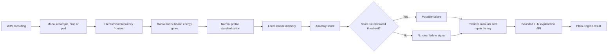

# Energy-Gated Frequency Networks


This repository is a **research-to-product project for acoustic anomaly
detection**. It starts with a physics-inspired neural unit for studying how
frequency energy can control a neuron, and evolves into an end-to-end system
that can accept an industrial recording, score it, retrieve relevant
evidence, and explain the result in ordinary language.

The project is intentionally documented as a research progression rather than
as a claim that one architecture replaces every Conv1D model. Each stage asks
a narrower question, measures the answer, and motivates the next engineering
change.

```text
research question
    -> physics-inspired frequency neuron
    -> controlled audio experiments
    -> temporal and hierarchical EGFN variants
    -> normal-only industrial anomaly detector
    -> calibrated score and failure alert
    -> SQLite knowledge base and retrieval
    -> bounded LLM explanation API
    -> Streamlit product demo
```

## 1. Where the project began: a physics-inspired neuron

The original idea was to embed a familiar signal-processing principle inside
a differentiable neuron: low-pass, high-pass, and band-pass filters should
separate frequency content, while measured energy in each band should modulate
the activation passed to the next layer.

For an input waveform `x[n]`, the first EGFN unit computes a bank of responses:

```text
u_k[n] = (h_k * x)[n]
a_k[n] = GELU(u_k[n] + b_k)
E_k   = mean(u_k[n]^2)
g_k   = sigmoid(alpha_k * log(1 + E_k) + beta_k)
y_k[n] = g_k * a_k[n]
```

The important design choice is that the response, energy, and gate remain
observable. The network is still learned, but its intermediate quantities have
a signal-processing interpretation that can be plotted and inspected.

### Original characteristics

- Raw waveform input rather than a fixed spectrogram.
- Eight frequency bands initialized from low, high, and band-pass regions.
- Three filter modes for research comparison: fixed FIR, free trainable FIR,
  and Sinc-parameterized cutoffs.
- A learned energy gate for every band.
- A compact pooled classifier based on band statistics and gate values.
- Controlled synthetic-signal tests before moving to spoken and industrial
  audio.

This first version was deliberately small. Its purpose was to test whether the
frequency decomposition and energy-dependent modulation could be observed, not
to maximize benchmark accuracy.

## 2. How the architecture evolved

The experiments exposed several limitations in the original pooled design.
Global pooling removed temporal order, and a free filter could improve
flexibility while becoming less physically interpretable. The architecture was
therefore changed in stages:

1. **Temporal head.** Gated sequences were sent to a lightweight Conv1D head
   instead of being reduced immediately to global statistics.
2. **Wide temporal model.** An `8 -> 32` projection and larger `64/128` temporal
   blocks gave the frequency frontend enough capacity for harder audio tasks.
3. **Hierarchical routing.** The industrial version uses three macro bands and
   sixteen subbands. Parent macro gates and child subband gates expose both
   coarse and fine spectral routing.
4. **Normal-only anomaly detection.** The objective changed from classifying a
   fixed list of labels to learning what normal operation looks like and
   measuring how far a new recording deviates from it.
5. **Calibration.** A threshold is selected on validation data and then kept
   separate from the test set. The deployed result is therefore a calibrated
   alert, not an arbitrary probability.
6. **Product wrapper.** Audio preparation, checkpoint loading, evidence
   storage, document retrieval, and a plain-language explanation layer were
   added around the detector.

The resulting industrial flow is:



## 3. The two reference dictionaries used by the detector

The anomaly model does not compare an audio file with a single opaque class
vector. It uses two complementary, normal-operation reference structures:

### 3.1 Normal-operation profile dictionary

For each known operating condition, the profile stores the mean, scale, and
record count of stable spectral-energy descriptors. A new recording is
standardized against the matching condition when available, or against a
fallback profile when the condition is unknown.

This dictionary answers: **how unusual is the energy pattern compared with
normal operation?**

### 3.2 Conditioned local-feature dictionary

The detector also stores a bounded set of normal local embeddings, indexed by
condition and subband. New local regions are compared with their nearest normal
examples, and the most unusual regions contribute to the recording-level
memory score.

This dictionary answers: **does this local sound resemble the normal local
patterns observed for this machine condition?**

The final decision is deterministic:

```text
possible_failure = anomaly_score >= validation_selected_threshold
```

The dictionaries are reference data, not labels invented by the LLM. They can
be retrained or extended when a real industrial deployment provides more normal
recordings and clearly identified operating conditions.

## 4. Parameter evolution and the Conv1D comparison

The parameter count changed as temporal structure and capacity were added. The
numbers below come from the controlled research reports:

| Stage | Model | Trainable parameters | What changed |
| --- | --- | ---: | --- |
| Initial | Pooled EGFN | 4,106 | Compact pooled band statistics |
| Temporal | EGFN temporal | 44,714 | Preserved time order with a Conv1D head |
| Wider | EGFN temporal wide | 189,802 | Added `8 -> 32` projection and larger temporal blocks |
| Capacity control | EGFN-Free | 188,770 | Matched the free Conv1D experiment |
| Current demo checkpoint | Hierarchical one-class EGFN | 304 trainable | Compact anomaly encoder; profiles and memories are stored reference data |

The current demo checkpoint is closest to the 304-parameter one-class DCASE Fan
control. This is the fair comparison for the compact encoder, because both
models have exactly the same trainable parameter count:

| Experiment | Conv1D-304 | EGFN-304 | Interpretation |
| --- | ---: | ---: | --- |
| DCASE 2020 Fan mean ROC AUC, 3 seeds | 0.515 +/- 0.032 | 0.592 +/- 0.034 | EGFN won AUC in all paired seeds at exactly 304 trainable parameters |
| DCASE 2020 Fan mean F1, 3 seeds | 0.163 +/- 0.020 | 0.217 +/- 0.099 | EGFN had higher mean F1, but thresholded F1 was less stable and Conv1D won seed 123 |

The older supervised comparisons are useful because they prevent overclaiming
while still showing where the frequency-gated architecture is competitive:

| Experiment | Conv1D baseline | EGFN variant | Interpretation |
| --- | ---: | ---: | --- |
| Speech Commands test accuracy | 0.892 | 0.886 (wide) | Close result, but EGFN used about 6.9x more parameters |
| MIMII Valve calibrated F1, seed 42 | 0.809 | 0.828 (free-filter wide) | EGFN improved calibrated F1 and AUC versus the smaller Conv1D baseline |
| Capacity-matched MIMII F1 | 0.848 | 0.828 (EGFN-Free) | Conv1D had stronger thresholded F1, while EGFN-Free kept the higher AUC at nearly equal parameter count |

The conclusion is therefore deliberately modest: at the current 304-parameter
operating point, EGFN shows a real ranking-quality advantage on the DCASE Fan
one-class control. The older supervised rows keep the scope honest: EGFN is a
frequency-structured and inspectable research architecture, not a blanket
replacement for Conv1D in every thresholded metric.

## 5. From research model to end-to-end product

The Streamlit application exposes the research result through a simple user
workflow:

1. Upload a WAV recording from a valve or another supported machine type.
2. The local checkpoint normalizes the waveform and computes the anomaly score.
3. The interface reports either **possible failure** or **no clear failure
   signal**, together with the score, threshold, and technical evidence.
4. A knowledge-base popup accepts manuals, reports, and repair records.
5. Relevant text is retrieved and combined with the audio diagnosis.
6. A bounded LLM API turns that evidence into a human-readable explanation:
   what was observed, what it may mean, what to check next, and what the audio
   cannot confirm.

The detector makes the decision. The LLM is an explanation layer: it cannot
load checkpoints, query arbitrary SQL, change the threshold, or override the
deterministic diagnosis.

## 6. Knowledge base, APIs, and future industry data

The application initializes a local SQLite database at
`evidence/egfn_context.sqlite3` with bounded, reviewable tables:

| Table | Purpose |
| --- | --- |
| `evidence` | Experiment artifacts and metric payloads |
| `history` | Evidence-ingestion history |
| `reference_items` | Human-readable project references |
| `documents` | Uploaded manuals and reports |
| `document_chunks` | Searchable document fragments |
| `repairs` | Machine, symptom, action, and outcome records |

The current retrieval implementation is keyword-based. Embeddings are the next
step once a real manual and repair corpus exists; generating vectors for an
empty knowledge base would add complexity without useful evidence. In a real
industrial deployment, the same bounded interface can ingest approved manuals,
maintenance logs, inspection results, and repair outcomes through scheduled
file imports or authenticated APIs. Every retrieved item should retain its
source path or document identifier so an explanation remains auditable.

## 7. Quick start

```powershell
.\.venv\Scripts\Activate.ps1
python -m pip install -r requirements-dashboard.txt
python scripts\build_evidence_json.py
.\.venv\Scripts\python.exe -m streamlit run app\dashboard.py
```

Open the local URL printed by Streamlit, normally `http://localhost:8502`.
The audio detector runs locally. The optional explanation step requires the
configured provider API key in the ignored `.env.local` file and available
project quota.

## Repository map

```text
frequency_gated_nn/
|-- app/dashboard.py                 Streamlit diagnosis and knowledge UI
|-- assets/egfn-logo.png             Project logo
|-- src/blocks/                      Frequency and hierarchical spectral blocks
|-- src/models/                      EGFN and anomaly model composition
|-- src/anomaly/                     Profiles, scoring, memory, regularization
|-- src/data/                        Dataset adapters and anomaly protocols
|-- scripts/build_evidence_json.py   Evidence snapshot builder
|-- scripts/train_*.py               Training entry points
|-- evidence/                        JSON evidence and local SQLite runtime data
|-- reports/                         Research reports, logs, and figures
|-- tests/                           Unit and protocol tests
|-- requirements-dashboard.txt       Dashboard, LLM API, and PDF dependencies
```

## Limitations and research boundaries

- The bundled demo is calibrated for MIMII valve audio; fan support needs a
  separately trained and calibrated checkpoint.
- A possible failure is an anomaly alert, not a confirmed mechanical diagnosis.
- Unknown operating conditions use fallback reference data and require review.
- Scanned PDFs need OCR before their text can be retrieved reliably.
- Embeddings are intentionally deferred until a real knowledge corpus exists.
- Research metrics are not automatically the result for every uploaded file.
- Human inspection and maintenance procedures remain required before action.

## Development checks

```powershell
.\.venv\Scripts\python.exe -m py_compile app\dashboard.py src\audio_diagnosis.py
.\.venv\Scripts\python.exe -m pytest tests\test_egfn_context.py -q --basetemp=.tmp\pytest-run
```

This repository demonstrates a complete path from a physical hypothesis to a
reviewable applied-AI system: interpretable signal structure, controlled
baselines, normal-only anomaly scoring, calibrated decisions, evidence
provenance, retrieval, and an explanation interface suitable for both
researchers and non-technical users.
